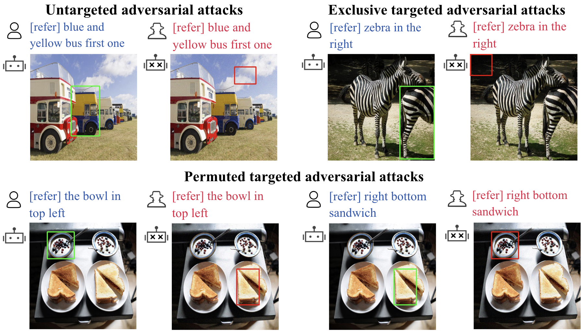

# Adversarial Robustness for Visual Grounding of Multimodal Large Language Models

This repository provides the pytorch implementatin of our ICLR 2024 Workshop on Reliable and Responsible Foundation Models work: [Adversarial Robustness for Visual Grounding of Multimodal Large Language Models](https://arxiv.org/abs/2405.09981).

## Abstract

Multi-modal Large Language Models (MLLMs) have recently achieved enhanced performance across various vision-language tasks including visual grounding capabilities. However, the adversarial robustness of visual grounding remains unexplored in MLLMs. To fill this gap, we use referring expression comprehension (REC) as an example task in visual grounding and propose three adversarial attack paradigms as follows. Firstly, untargeted adversarial attacks induce MLLMs to generate incorrect bounding boxes for each object. Besides, exclusive targeted adversarial attacks cause all generated outputs to the same target bounding box. In addition, permuted targeted adversarial attacks aim to permute all bounding boxes among different objects within a single image. Extensive experiments demonstrate that the proposed methods can successfully attack visual grounding capabilities of MLLMs. Our methods not only provide a new perspective for designing novel attacks but also serve as a strong baseline for improving the adversarial robustness for visual grounding of MLLMs.

<div align=center>
<br/>
</div>

## Installation

This environment is based on [MiniGPT-v2](https://github.com/Vision-CAIR/MiniGPT-4).

## Data Preparation

Please download MS-COCO dataset from its [official
website](https://cocodataset.org/).

## MLLM Grounding Robustness

Run the following command to perform untargeted image embedding attack.

```shell
bash scripts/untargeted_image_embedding_attack.sh
```

Run the following command to perform untargeted textual bounding box attack.

```shell
bash scripts/untargeted_textual_bounding_box_attack.sh
```

Run the following command to perform targeted exclusive adversarial attack.

```shell
bash scripts/targeted_exclusive_adversarial_attack.sh
```

Run the following command to perform targeted permuted adversarial attack.

```shell
bash scripts/targeted_permuted_adversarial_attack.sh
```

## Citation

```
@inproceedings{gao2024adversarial,
  title={Adversarial Robustness for Visual Grounding of Multimodal Large Language Models},
  author={Gao, Kuofeng and Bai, Yang and Bai, Jiawang and Yang, Yong and Xia, Shu-Tao},
  booktitle={ICLR Workshop on Reliable and Responsible Foundation Models},
  year={2024}
}
```

## Acknowledgements

This respository is mainly based on [MiniGPT-v2](https://github.com/Vision-CAIR/MiniGPT-4). Thanks for their wonderful works!
